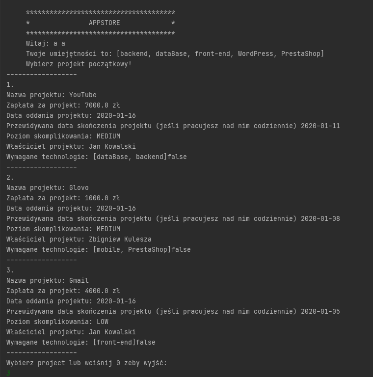
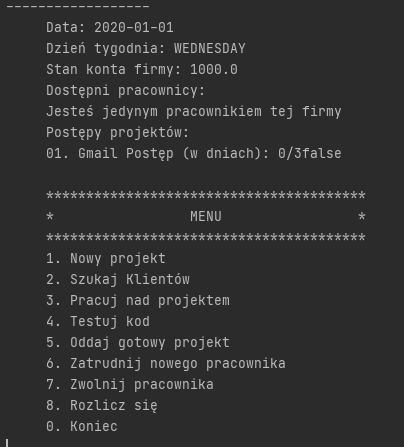
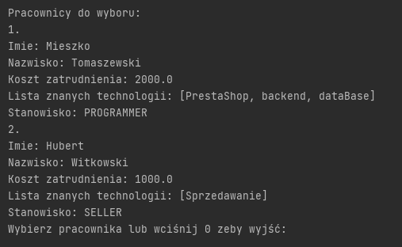

# Project Name
A console game that simulates a software company. The game was written in Java.

## Table of Contents
* [General Info](#general-information)
* [Gameplay description](#gameplay-description)
* [Object of the game](#object-of-the-game)
* [Features](#features)
* [Screenshots](#screenshots)
* [Usage](#usage)
* [Project Status](#project-status)
* [Room for Improvement](#room-for-improvement)
* [Acknowledgements](#acknowledgements)

## General Information
- You start out with a certain (small) amount of money. You don't have any employees, office or clients. You can program in Java, you know something about databases and you can make a front-end to the application. You can't do mobile applications. You have to outsource this part, hire an employee or avoid this type of project. You can also set up a website on wordpress and a simple store on prestashop.
- At the beginning of the game, you have the option of getting one of the three projects to implement. Projects can be simple, medium and complex. Without employees, you can only implement simple and medium-sized projects. Each run of the program results in different available projects. Each project is described by a set of features:
 1. project name
 2. the number of man-days needed for implementation, broken down by individual technologies
 3. customer
 4. deadline
 5. the amount of the penalty for exceeding the deadline
 6. the price that the customer can pay for the implementation
 7. payment date (how many days will pass from handing over the project to receiving payment)
 8. complexity level (easy / medium / complex)
 
- Most projects do not support all technologies. Simple projects may require knowledge of only one of them, average at least 2, complex at least 3. Complex projects require more man-days, but some money may be paid in advance as an advance payment.
- The same client may commission several different projects for implementation, but clients can be divided into several groups:
1. relaxed - 30% chance of delaying payments by a week, but also 20% chance of avoiding a penalty for delay, if it is not more than a week, handing over a broken project does not cause additional problems
2. demanding - 0% chance of delaying payment, 0% chance of avoiding a penalty, returning a broken project is a 50% chance of losing the contract without reimbursement
3. very demanding - 30% chance of delaying the payment by a week, 5% chance of delaying the payment by a month, 0% chance of avoiding a penalty, 100% chance of losing the contract after handing over a broken project, 1% chance of never receiving payment
- The player does not know which group belongs to which client.
- You can carry out projects yourself, outsource the work to a subcontractor or hire employees. You have three friends from studies who you can hire as subcontractors:
1. the best student - the most expensive, but he does it on time and without mistakes
2. average student - does it on time, but there is a 10% risk that you will have to correct it afterwards
3. student below average - the cheapest, 20% risk that he will be late and 20% risk that he will have to improve after him.
- At the beginning of each game, a set of skills is drawn for each of them. You also have some potential employees that you can hire. Each of them has certain skills and salary requirements. Initially, the base is small, but if you spend money on advertisements, the number of potential employees available should increase. You can hire three types of workers:
1. programmers with knowledge of specific technologies who implement projects with certain accuracy and punctuality
2. a seller who is looking for new customers - every 5 working days adds a new project to the pool of projects available for implementation
3. tester, having at least one tester in three developers ensures that you do not hand over a broken project to the client
- Employing an employee costs money, keeping an employee costs money, firing an employee costs money. In addition to the salary for the employee, you must pay the costs of the workplace, health insurance, tax, etc., these can be fixed amounts or a fixed % of the net salary.

## Gameplay description
- You start work on January 1, 2020, each day is one round. If it is a non-working day, you can work independently, if it is a working day, you can work independently, your subcontractors and employees work.
- Every day you can do one of the following:
1. sign a contract for the implementation of one of the available projects
2. Allocate a day to look for customers (every 5 days is one new project available)
3. devote a day to programming
4. allocate a day for testing (you can test your own code, code of subcontractors and employee code)
5. hand over the finished project to the client
6. hire a new employee
7. dismiss an employee
8. allocate a day for settlements with offices (if you do not spend 2 days a month, you lose)
- If you have employees, they carry out their duties every working day, but there is a small chance that one of them will get sick and not come to work. At any time, you can check the implementation status of individual projects, view available projects, view available employees and check the account balance. If the employees are not paid, they leave. If your balance drops to 0, you lose.

## Object of the game
- Obtaining full payment for 3 large projects under which the owner of the company did not perform any programming or testing work, of which at least 1 was obtained by an employed salesperson and having funds higher than the initial capital on the account.

## Features
- the ability to choose the initial project
- the ability to work on a project
- the option of hiring employees
- the ability to test the code
- dedicating the day to accounting settlements
- option to dismiss an employee
- option to look for new customers
- option to return the finished project
- percentage calculation of the chances of various unforeseen accidents at work

## Screenshots

## Usage
All you have to do is run the code. Nothing but Java and IDE are needed

## Project Status
Project will be rewritten in the future. Adding tests and Maven type tools would significantly improve the work and understanding of the application code.

## Room for Improvement
To do:
- Adding tests
- Changing logic in some aspects of how the code works
- The application of the principles of clean code
- Fixed a bug related to an incorrect in-game date
- Changing the graphic design from console to more user-friendly

## Acknowledgements
- The project was created as part of the completion of object-oriented programming in Java.

